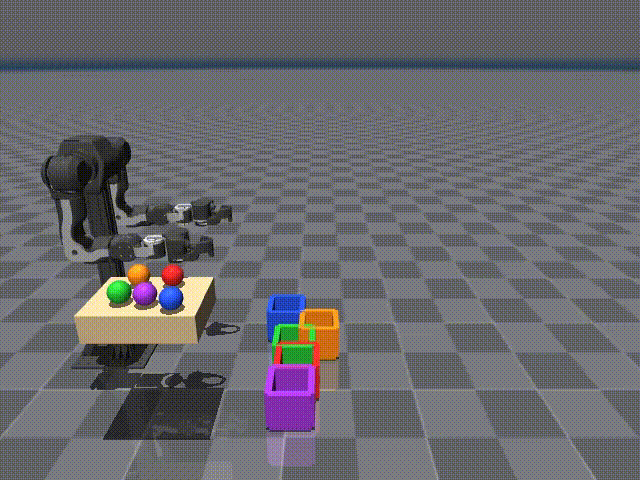
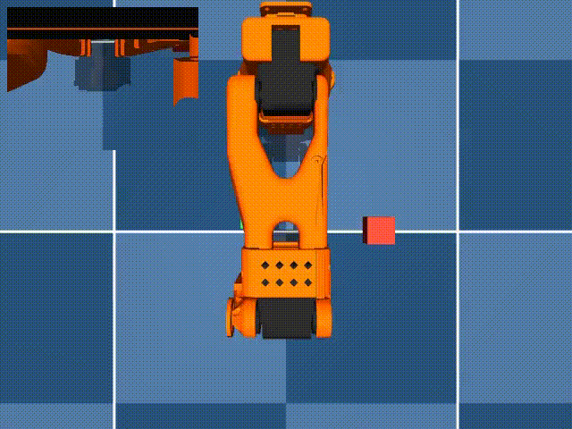
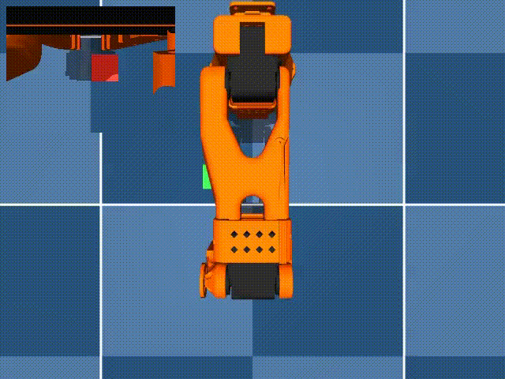
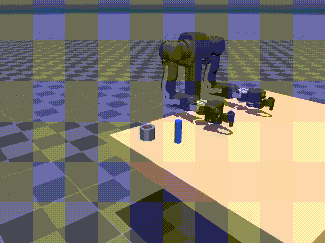

# Language-conditioned robot control in simulation

Three simulated arms follow a sentence. The clips below are the behaviors that already work. The throw and the peg insertion are the scripted expert. The two stacks are a fine-tuned [SmolVLA](https://huggingface.co/blog/smolvla) policy.

## Demos

**Throw the green ball into the blue bucket.** OpenArm, right arm. Five balls and five bins, colors shuffled. The arm picks the green ball off the side table and lands it in the blue bin.

**Stack the red cube on the green cube.** SO-ARM100. The first grasp slips, the arm picks the red cube up again, and sets it on the green cube.

**Stack the green cube on the red cube.** The same policy, the other sentence. It loses the cube once, grasps it again, and finishes the stack.

**Place the peg in the hole.** OpenArm again. The right arm grasps the peg, seats it, and lets go. The peg stays in the socket.

## The project

A policy sees two cameras, its own joints, and the instruction, and it outputs joint targets. Object positions are withheld from it. A scripted expert uses those positions to record successful demonstrations, and SmolVLA is fine-tuned on that data through [LeRobot](https://github.com/huggingface/lerobot).

SmolVLA is a SmolVLM2 vision-language model with a flow-matching action expert. The vision tower and the language model stay frozen. Training updates the action expert, about 100M of the 450M parameters. The aim is a single recipe that can throw, stack, or insert because the sentence changed, with the arm closed-loop on the live cameras.

## Where it stands

| Task | Demonstrator | Learned policy |
|---|---|---|
| Throw a named ball into a named bin | 87/100 | No scored rollout lands the ball. The hand finishes several centimeters short. Reading the ball's position from the image missed a 5 cm gate; the best readout was 9 cm. |
| Stack, with the true cube positions in the state | scripted demos | 5/10 stacks and 9/10 grasps. Vision stayed frozen. |
| Either stack sentence | scripted demos | 7/10 red on green, 6/10 green on red. The sentence is a frozen classifier's two logits, written into the state next to the true cube positions. The clips above are from this checkpoint. |
| Stack with colors held out of training (yellow, blue) | — | Not trained. Those color words did not separate in the frozen text features. |
| Peg in the hole | 18/20, within 2 mm | 0/5 grasps. The closest approach was about 4 cm. The hole allows about 6 mm. |

The action expert copies the demonstrated reach. The open problem is seeing which object the sentence named. A pinch needs about a centimeter, and the peg hole needs about 6 mm. The measured visual error is still several centimeters, so another action-only fine-tune on the throw or the peg would fit the joint targets and still miss.

The stack is further along because the policy is told where the cubes are, and it replans from those live positions. That is why a slip can be grasped again. Red versus green is already readable from the frozen sentence embedding (the probe was perfect on held-out frames, and a label-shuffle control was near chance). Yellow and blue were not, so that run was stopped before training.

## Goal

A policy that throws, stacks, and inserts from the cameras and the sentence alone. The next useful measurement is a localizer that beats the centimeter gate on held-out frames before the action head is trained again. For stacking, the following step is a sentence the probe has not memorized, and then cube positions that come from vision rather than from the simulator.

## How the runs are set up

- Demonstrations are successful expert episodes only. The expert is open-loop and uses the true object poses. The policy never trains on those poses for the throw or the peg.
- On the stack, the true cube positions were the scaffold that made the motion learnable. The sentence was added afterward as two numbers in the same state vector.
- A small probe scores the frozen features before a long train: where is the ball, and which cube does this sentence name? Training starts only when that probe passes.
- Control is closed-loop. Physics pauses while the network predicts a short chunk of joint targets, then the policy replans from the new observation.

Write-ups of the measured runs are in [`findings/`](findings/README.md), [`trs_so_arm100/`](trs_so_arm100/sentence/cont/run1/REPORT.md), and [`peg_socket/REPORT.md`](peg_socket/REPORT.md).
