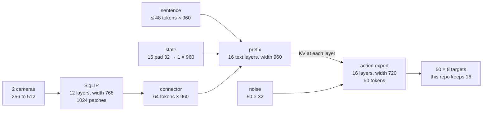

# SmolVLA, with the sizes

This is the network `vla_viewer.py` and `train_smolvla.py` load. The picture is `smolvla_architecture.svg`. The numbers were read from the weight headers of `HuggingFaceTB/SmolVLM2-500M-Video-Instruct` and `lerobot/smolvla_base`, and from the forward pass in lerobot 0.6.1. They are not the round numbers from the blog post.

SmolVLA is two transformers that share a layer index.

The first is SmolVLM2. A vision tower turns each camera into tokens, a small connector shrinks those tokens, and 16 text layers mix them with the sentence and the arm's own joints. Those 16 layers are the first half of a 32-layer language model. The second half is deleted after the weights are loaded.

The second is the action expert. It does not emit words. It holds 50 vectors of noise and, ten small steps later, those vectors are joint targets. At every odd layer it looks up the keys and values the vision-language model stored for that same layer.



## What this robot hands it

One control step, before any network, is four arrays.

| Input | Shape in this env | What the network actually sees |
|---|---|---|
| `image_front`, `image_wrist` | `256×256×3`, pixels 0…1 | Resized with padding to `512×512`, then mapped to −1…1. SigLIP's native size is 512. |
| `instruction` | a sentence | Token ids, at most 48 of them. A throw sentence is about ten. |
| `state` | 15 floats: 7 joint positions, 7 joint velocities, 1 finger | Padded with zeros to 32. |

The 32 is `max_state_dim` in `SmolVLAConfig`. The same pad exists on the way out: the expert always emits 32-D actions, and the first 8 are the OpenArm targets (joints 1–7 and the finger). Dims 8–31 are zeros the loss ignores.

## The vision tower

Each camera is its own forward pass. The tower is a SigLIP-shaped encoder: 12 layers, width 768, 12 heads of size 64, MLP 768 → 3072 → 768. The patch embedding weight is `(768, 3, 16, 16)`.

```
512 × 512 × 3
    │  non-overlapping 16×16 patches
    ▼
32 × 32 = 1024 tokens, each 768
    │  12 blocks. Each block:
    │    LayerNorm → attention (Q,K,V,O all 768) → add
    │    LayerNorm → GELU MLP 768→3072→768 → add
    ▼
1024 × 768
```

There is no class token. 1024 is exactly 32², and the next stage needs a square grid.

The pixels from both cameras never enter the language model directly. Only these 1024 vectors do, and they still have to be shrunk.

## The connector

`scale_factor` in the SmolVLM2 config is 4. Pixel-shuffle groups each 4×4 block of patches into one vector.

```
1024 × 768
    │  32/4 = 8, so an 8×8 grid
    │  each new token is 16 old tokens: 768 × 16 = 12288
    ▼
64 × 12288
    │  Linear, no bias. Weight is (960, 12288)
    ▼
64 × 960
```

Sixty-four tokens per camera. Two cameras make 128. The connector weight in the checkpoint is exactly that matrix. After the projection, each image token is multiplied by √960 so it sits on the same scale as a word token.

## The prefix tape

The text transformer never sees an image tensor. It sees one sequence of 960-D vectors, built by concatenation:

```
[ front: 64 tokens | wrist: 64 tokens | words: L tokens | state: 1 token ]
                 all width 960
```

`L` is the tokenized sentence, padded to the longest sentence in the batch and capped at 48. Word tokens come from the language-model embedding table (vocab 49280) and are also scaled by √960. The state token is `Linear(32 → 960)` applied to the padded 15-D state. Weight `(960, 32)`.

Who may look at whom is one integer per token, turned into a mask by a cumulative sum. A token may attend to any token whose running sum is less than or equal to its own.

| Tokens | Mask value | Effect |
|---|---|---|
| Both cameras and the sentence | 0 | One block. They all see each other. |
| The state token | 1 | It can see the cameras and the sentence. They cannot see it. |
| Each action token, later | 1 | Causal. Action i sees the whole prefix and actions 0…i. It does not see future actions. The prefix does not see any action. |

So the sentence can look at both pictures, and neither picture can look at the joint vector or the action being denoised.

## One text layer

SmolVLM2's language model has 32 of these. The SmolVLA config sets `num_vlm_layers = 16`, and the code keeps `text_model.layers[:16]`. Every load does this in order: read all 32 layers from `SmolVLM2-500M`, print "Reducing the number of VLM layers to 16", drop layers 16–31, then copy the `smolvla_base` weights on top. Those saved weights already have 16 text layers. The file does not still contain the dropped half.

A single kept layer, sequence length S (about 140 for two cameras and a short sentence):

```
input                          (S, 960)
  RMSNorm
  Q  Linear 960→960            15 heads × 64
  K  Linear 960→320            5 heads × 64
  V  Linear 960→320
  the 5 KV heads are repeated ×3 so they match the 15 query heads
  scores = Q Kᵀ / √64, softmax, times V
  out-proj 960→960
  add the input back
  RMSNorm
  SwiGLU: 960 → 2560 → 960     down-proj weight is (960, 2560)
  add back
output                         (S, 960)
```

RoPE is applied to Q and K. The head size 64 is why the score is divided by 8.

During a viewer frame this stack runs once. Every layer writes its keys and values into a cache. The action expert reads that cache. It does not ask the language model to produce a word, and the token-prediction head (`lm_head`) is not on this path.

Layers 16–31 are the ones a chatbot would use to finish a sentence. They are the half that gets cut. The expert was trained against the 16-layer cache, so putting those layers back would be a different model than `smolvla_base`.

## The action expert

The expert is a second transformer of 16 layers, built by copying the text config and then narrowing it. `expert_width_multiplier` is 0.75, so the width is `int(960 × 0.75) = 720`. The MLP width is 2048, from the formula in `get_intermediate_size`. The checkpoint agrees: `gate_proj` is `(2048, 720)`.

It keeps the text model's head layout: 15 query heads, 5 key/value heads, head size 64. Those 15 heads want 960 dimensions, and the residual stream is only 720, so the projections are rectangular. That is visible in the weights:

| Matrix | Even layer (self-attention) | Odd layer (cross-attention) |
|---|---|---|
| Q | `(960, 720)` | `(960, 720)` |
| K | `(320, 720)` from the action token | `(320, 320)` from the cached VLM key |
| V | `(320, 720)` | `(320, 320)` |
| out | `(720, 960)` | `(720, 960)` |
| MLP gate | `(2048, 720)` | `(2048, 720)` |

Even and odd are `layer_idx % 2`. Layer 0 is self-attention. Layer 1 is cross-attention. Eight of each.

```
layer 0   self     actions attend to actions, causally
layer 1   cross    actions attend to VLM layer 1's cached prefix
layer 2   self
layer 3   cross    … VLM layer 3
  …
layer 14  self
layer 15  cross    … VLM layer 15
```

The prefix pass does not run the expert. Its input is `None` on that pass, and every VLM layer uses ordinary self-attention so the cache fills. The denoising pass does not re-run the cameras. Its VLM input is `None`, and the odd layers read the cache instead.

Cross-attention, for one odd layer:

```
action tokens                         (50, 720)
  RMSNorm, then Q: 720 → 960          15 × 64
cached VLM K,V at this layer          (S, 5, 64)  →  flattened to (S, 320)
  K and V projected 320 → 320
  RoPE on the action queries
  the action queries attend over the prefix keys
  out-proj 960 → 720, add residual
  MLP 720 → 2048 → 720, add residual
```

Self-attention is the same block, except K and V come from the action tokens themselves (`720 → 320`), and the mask is causal inside the chunk. After a self-attention layer the code appends those action keys into the cache, then crops the cache back to the prefix length before the next denoising step. The prefix cache has to stay the one computed from the cameras.

## From noise to a joint target

The expert does not regress the action in one shot. It is a flow-matching model. A chunk is a tensor `(50, 32)`. Training draws a time `t` in `(0, 1)` and a Gaussian noise tensor of the same shape, and builds the straight line

```
x_t = t * noise + (1 - t) * action
u_t = noise - action
```

At `t = 1` the sample is pure noise. At `t = 0` it is the demonstration. The network's job is to look at `x_t` and `t` and predict `u_t`. The loss is mean squared error on that vector, cropped to the real action width (8 in this env) and with padded timesteps dropped.

`t` becomes a 720-D sine/cosine vector (`min_period` 0.004, `max_period` 4). Each of the 50 action tokens is `Linear(32 → 720)`, concatenated with that time vector to make 1440, then

```
Linear 1440 → 720, SiLU, Linear 720 → 720
```

Those 50 vectors are the expert's input sequence. The expert's output is 720-D per token. `action_out_proj` is `Linear(720 → 32)`.

At inference there is no demonstration. `sample_actions` draws `noise` of shape `(1, 50, 32)` and calls an Euler solver for `num_steps = 10`. Each step runs only the expert (the prefix cache is reused) and follows the predicted velocity toward the action. Ten expert passes per replan, not one.

The adapter in this repo then does `actions[0, :16]`. The network still spent its ten passes filling all 50. `configs/eval.yaml` plays 16 of them and replans every 8 control steps. Control is 50 Hz, so those 8 steps are 0.16 s of wall clock plus however long the ten passes take. Physics does not advance during the passes.

## What a training step is allowed to change

`train_expert_only` and `freeze_vision_encoder` both default to true.

Frozen, and still executed: the 12 vision layers, the connector, and the 16 text layers. Their outputs are the prefix cache. Gradients are not applied to them.

Trained: the action expert, `state_proj`, `action_in_proj`, `action_out_proj`, and the time MLP. That is the "~100M of 450M" in `AGENTS.md`. The blog's "about 100M" action expert is this stack.

`--train-vision` is the exception used in the head-camera vision run. It turns gradients back on for the SigLIP tower only. The language-model weights stay frozen. The loss is still the flow-matching loss on joint targets, so the error that reaches SigLIP has already passed through the expert. There is no separate loss for "where is the ball."

The base checkpoint's action expert was trained on an SO-100, whose action vector is 6-D. This env's vector is 8-D. Both fit in the 32-D pad, which is why the tensors load. The numbers inside them are targets for a different arm. That is why `smolvla_base` in the viewer moves and does not grasp.

## Where the probe sits on this picture

The vision probe never builds the action tape and never runs the expert. It takes a saved frame, runs the frozen tower and connector, and fits a small readout from those image tokens plus a color one-hot to the ball's true table position. On the shoulder camera at reset, tokens plus the right color score 11.0 cm and the color alone scores 9.6 cm. The 64×960 front-camera tokens, after 12 vision layers and the connector, do not contain a position the readout can use. The rest of this diagram is what those tokens are, and what the expert would have done with them.
