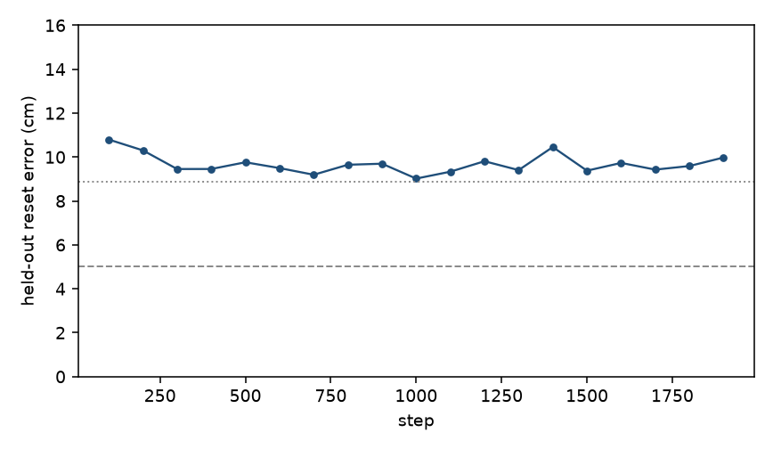
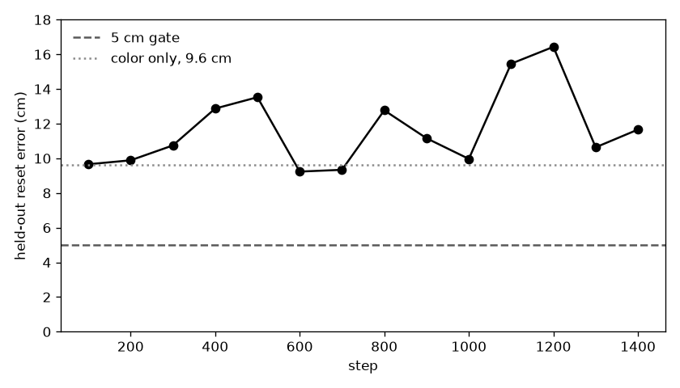

# vision_xy

SigLIP was asked for the named ball's position. The action expert was not trained. A readout of the 8×8 front-camera grid misses by 9.0 cm on the 20 held-out reset frames. Guessing from the color and ignoring the picture scores 8.9 cm on these frames. Training the tower for two hours with that grid readout bottoms at 9.0 cm. The gate was 5 cm. No checkpoint was saved, and the arm was not rolled out.

## The grid

The earlier readout averaged the 64 connector tokens into one vector. This one keeps the 8×8 grid. A linear map reads all 64 tokens, each 960 wide, plus a one-hot of the named color, and predicts xy. Front camera only. The language model, the connector, and the action expert stayed frozen.

Frozen tower first. The color one-hot was set to the mean position of that color on the training layouts, and the image weights started at zero. That color-only guess scores 8.9 cm on the 20 validation resets. Letting the image weights move drove the training-layout reset error to 0.9 cm and the error on 10 layouts held out of the fit to 32 cm. Every weight-decay setting preferred the image weights at zero. Scored on the validation resets, that model misses by 9.0 cm.

SigLIP was then trained at `1.0e-5` with the same grid readout. The readout's learning rate was `1.0e-3`. Batch 4. The run hit the two-hour cap at step 1900. Training resets stayed a few centimeters off.

Plotted from `artifacts/vision_xy/grid_train_log.csv`. The dashed line is the 5 cm gate. The dotted line is 8.9 cm, the color-only guess on these validation frames.

| Step | Held-out reset error |
|---|---|
| 100 | 10.8 cm |
| 200 | 10.3 cm |
| 300 | 9.5 cm |
| 400 | 9.5 cm |
| 500 | 9.8 cm |
| 600 | 9.5 cm |
| 700 | 9.2 cm |
| 800 | 9.7 cm |
| 900 | 9.7 cm |
| 1000 | 9.0 cm, the best |
| 1100 | 9.3 cm |
| 1200 | 9.8 cm |
| 1300 | 9.4 cm |
| 1400 | 10.5 cm |
| 1500 | 9.4 cm |
| 1600 | 9.7 cm |
| 1700 | 9.4 cm |
| 1800 | 9.6 cm |
| 1900 | 10.0 cm |

No checkpoint was written. There is no `eval_summary.json`.

The grid was the open question in the mean-pool section below. A reader that keeps every token can memorize the layouts it is fit on, and on a layout held out of that fit it is worse than ignoring the picture. The weights that score 9.0 cm on the validation resets are the ones that ignore the image. Two hours of SigLIP training did not move that number under 5 cm.

Sources: `artifacts/vision_xy/grid_frozen.json`, `artifacts/vision_xy/grid_frozen_adam_stdout.txt`, `artifacts/vision_xy/grid_train_log.csv`, `artifacts/vision_xy/grid_probe.json`.

## Pointing

SmolVLM2-500M-Video-Instruct was asked, in its chat format, for the pixel of the named ball. All 32 text layers, fp32. Nothing was trained. The arm was not rolled out.

Same 20 validation resets. The true pixel is the ball center projected into `headcam` after reset. That projection sits on the named color in every frame. The ball is 6 cm across, about 8 pixels here. A point is on the ball only when it falls inside that disk. Every reply was two numbers already in the 256-pixel frame, so none was rescaled.

One overhead frame. All 20 replies parsed. Every reply was `10, 10`. Median error 170.5 pixels. 0 of 20 land on the ball.

Three images of the same reset, named in order: overhead headcam, right wrist, left wrist. The question asked for the ball in the overhead frame only. All 20 replies parsed. Eight were `10 10` and twelve were `100 100`. Median error 67.6 pixels. 0 of 20 land on the ball. The nearest is 10.6 pixels out, against a radius of 8.2 on that frame.

The reply stays on one of those two pixels while the ball moves. The 9.0 cm grid miss came from a linear map on vision tokens, and that test never asked the language model. Asked in words, the model this tower is built on misses the ball on these frames as well. Collecting more demonstrations will not fix that. There is no `eval_summary.json`.

The chat processor resized each 256 frame to 2048 and split it into a 4×4 of crops plus one global view. That is this checkpoint's preprocessing. The question still asked for a coordinate on the 256 image.

Sources: `artifacts/vision_xy/vlm_point.json`, `artifacts/vision_xy/vlm_point_sheet.png`, `artifacts/vision_xy/vlm_point_overlays/`, `scripts/vlm_point.py`.

## Mean pool

Started from `lerobot/smolvla_base`. Same 50 training episodes and 20 validation episodes as the head-camera runs (`data/datasets/train_head`, `data/datasets/val_head`). The language model, the connector, and the action expert stayed frozen. Only the SigLIP tower was trained, plus a linear readout that is thrown away after the measurement.

The readout averages the 64 front-camera tokens into one vector, appends a one-hot of the named ball's color, and predicts xy. Learning rate `1.0e-5` on SigLIP and `1.0e-3` on the readout. Batch 4. The front camera is the live overhead `headcam`. The wrist camera was not used.

The datasets do not store ball positions. Each seed was replayed with the stored actions. Joint state matched the recording exactly, and the wrist frames stayed within about 4 gray levels, so the positions belong to those episodes. The stored front video does not match the live overhead camera (about 48 gray levels on the first training frame). Training used fresh renders from the live camera, not that stored video.

Training stopped at step 1400, when the held-out error had failed to improve by 0.3 cm for eight checks. The best check was step 600.

## The error

Plotted from `artifacts/vision_xy/train_log.csv`. The dashed line is the 5 cm gate. The dotted line is 9.6 cm, the frozen-token probe's score for guessing from the color and ignoring the image.

| Step | Held-out reset error |
|---|---|
| 100 | 9.7 cm |
| 200 | 9.9 cm |
| 300 | 10.7 cm |
| 400 | 12.9 cm |
| 500 | 13.5 cm |
| 600 | 9.2 cm, the best |
| 700 | 9.3 cm |
| 800 | 12.8 cm |
| 900 | 11.2 cm |
| 1000 | 10.0 cm |
| 1100 | 15.5 cm |
| 1200 | 16.4 cm |
| 1300 | 10.6 cm |
| 1400 | 11.7 cm |

Training error on the 50 episodes fell to about a millimeter. The 20 new layouts did not.

## The robot

No closed-loop eval was run. There is no `eval_summary.json`. The action expert is still the SO-100 head from `smolvla_base`.

## Why this happened

Fifty layouts were enough to memorize. They were not enough to report the ball's position on a layout the tower had not seen. The best held-out number, 9.2 cm, sits on the color-only guess from [probes](../probes/REPORT.md).

This is a different failure from [headcam_vision](../headcam_vision/REPORT.md). That run trained SigLIP with the arm's joint loss and judged it by that loss. This run asked for the ball's xy directly and judged it by centimeters on new reset frames.

The average can throw away which of the 64 tokens the ball is in. The grid section above is that reader. It also misses.

Sources: `artifacts/vision_xy/probe.json`, `artifacts/vision_xy/train_log.csv`, `scripts/train_vision_xy.py`, `scripts/label_ball_xy.py`.
