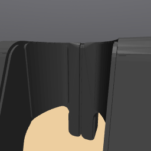
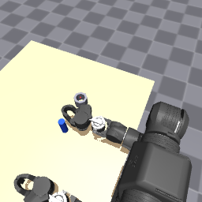
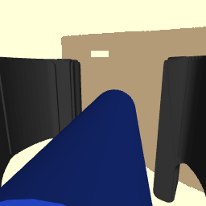
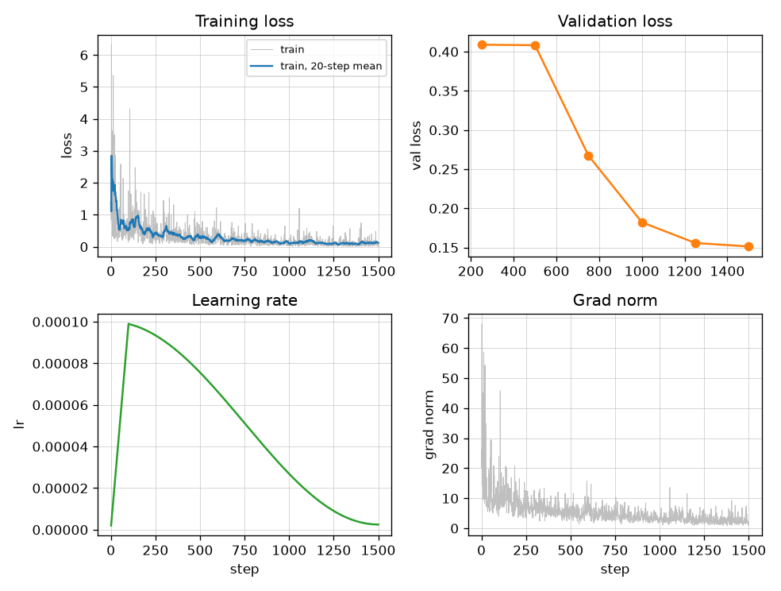
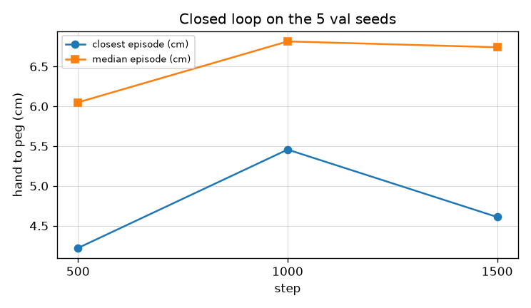
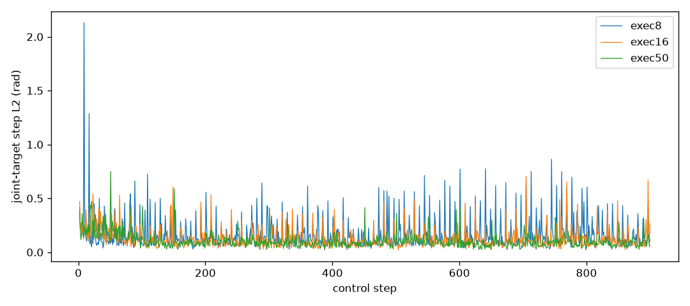
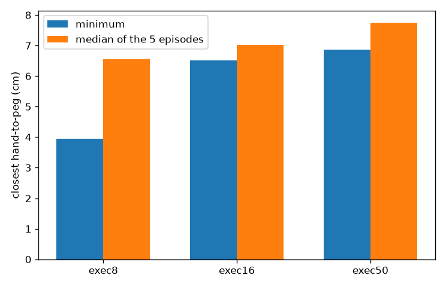

# Peg in the hole

The scripted expert inserts the peg. No learned policy does.

The expert put the peg in the hole on 18 of 20 legal layouts, 0.2–1.9 mm from the hole center. `lerobot/smolvla_base` inserted 0 of 20 and grasped 0. A face-camera fine-tune on 10 demonstrations drove validation loss from 0.409 to 0.151 and still grasped 0 of 5. The closest that hand came was 4.22 cm. The hole allows about 6 mm. Playing the full 50-step action chunk did not smooth the arm and did not insert the peg. Asking the frozen SmolVLM2 tower where the peg is was blocked by GPU memory, so that gate was never scored, and the gated fine-tune (step 6 in the old plan) was never started.

Clips and plots are in [media/](media/).

## Task

One peg, one socket, one sentence: `place the peg in the hole`. The policy sees that sentence, its own joints, `tablecam`, and `camera_wrist_right`. It does not see the peg position or the socket position. The expert does.

The peg radius is 1.4 cm and the socket's inner radius is 2.0 cm, so the peg center has to stay within about 6 mm of the hole center. Success is that condition, upright, for 0.5 s. Failures are `never_grasped`, `dropped`, `missed`, or `timeout`.

Right arm only. The left arm holds the home ctrl every step. The action is 8 absolute targets (right joints 1–7 and `right_finger1_ctrl`). The state is 15 (right qpos, qvel, and finger qpos). Images are 256×256 RGB. `tablecam` is stored as `observation.images.image_front`. The wrist camera is `observation.images.image_wrist`. `frontcam` is unused. Grasp is friction only. `grasp_right_peg` stays off.

The scene is [peg_socket_scene.xml](peg_socket_scene.xml), a copy of `v2/pedestal/peg_socket_scene.xml`. `v2/` was not edited. The copy adds `<joint name="socket_free" type="free"/>` and extends the `home` keyframe with the socket pose `0.36 -0.26 0.40 1 0 0 0` at qpos address 25.

## Scene

Reset to keyframe `home` (key 0) matches the stored qpos with max abs error 0. Both arms sit in that pose. Moving `socket_free` by +0.08 m moves the socket body by 0.08 m in x, and resetting restores it.

`render_home.py` loaded the copy, reset to key 0, shifted the free joint, reset again, and wrote the two 256 frames. That script is gone. The wrist frame at home is below. The overhead face frame from this check was later replaced; the comparison is in [Face camera](#face-camera).



## Expert

`peg_expert.py` plans an open-loop sequence from the true peg and socket poses with `openarm_vla/expert/ik.py`, then replays joint targets. Phases are hover, open, descend, close, lift, carry, lower through the hole, open, retreat. The lower stops while the finger meshes are still above the octagon. The peg is already in the hole and drops the last centimetre. A planning rollout measures where the hand actually sits (gravity sag on the position actuators is about 12 mm) and shifts the aim before the replay.

`eval_peg_expert.py --n 20 --max-seeds 400` scored the first 20 legal draws from seeds `0, 1, 2, ...`, scanning seeds 0 through 89.

A draw is uniform in x `[0.18, 0.36]`, y `[-0.45, -0.18]`, and legal when:

- both objects are upright on the tabletop (center `(0.47, 0)`, half-extents `(0.41, 0.55)`, top at z `0.40`)
- at least 1 cm clear of the pedestal and of either gripper at the home pose
- peg center at least 0.12 m from the socket center
- the peg is not already in the hole
- the same downward yaw reaches hover, grasp, lift, and carry within 3 mm

70 draws were rejected: 48 too close, 14 inside the home gripper or pedestal, 2 knocked during the home settle, 6 unreachable.

Inserted means the peg center stays within 7 mm of the hole center, between 40 mm and 51 mm above the socket origin, and upright, for 0.5 s after the fingers open.

| | |
|---|---|
| Inserted | 18/20 |
| Seeds | 0, 3, 5, 11, 13, 15, 18, 22, 23, 26, 36, 47, 52, 58, 62, 64, 66, 75, 81, 89 |

Successes finished 0.2 mm to 1.9 mm from the hole center. The socket did not slide.

| Seed | Cause | Reason |
|---|---|---|
| 62 | never_grasped | closest 84 mm, peg ended on its side |
| 89 | never_grasped | closest 149 mm, peg ended on its side |

Both started near `(0.29, -0.24)`, under the throw-ready transit the approach still uses. The grasp point of that transit is about `(0.24, -0.23, 0.53)`. The arm knocks the peg over on the way to the hover. Replacing that transit with one high waypoint fixed seed 62 and made seed 0 unreachable. Leave the sag-correction loop in place. Kinematic IK alone sits about 12 mm off, and the peg then hits the octagon.

[Seed 0, inserted](media/videos/expert_inserted_seed0.mp4). [Seed 62, knocked over](media/videos/expert_knocked_seed62.mp4).

## Demonstrations

`collect_peg_demos.py` replays that expert. Obs is stored before the action. Success episodes only. The task string is `place the peg in the hole`. `ball_color` is `peg` and `bin_color` is `socket` so `scripts/dataset_stats.py` can read `openarm_seeds.json`. The legal draw is the expert's draw, plus a rule that the peg cylinder and the socket walls project inside `tablecam` with a 16 px margin on the 256 image.

Overhead camera, collected before `tablecam` was moved:

```
collect_peg_demos.py --n-success 50 --seed-start 1000 --seed-end 5000 --out data/datasets/peg_train
collect_peg_demos.py --n-success 20 --seed-start 5000 --seed-end 9000 --out data/datasets/peg_val
```

One collector at a time. Starting both at once killed the val video workers with `WinError 1455` (paging file too small). That partial `peg_val` was deleted and collected after train had exited.

| | Train | Val |
|---|---|---|
| Saved | 50 | 20 |
| Seeds scanned | 1000–1271 | 5000–5108 |
| Frames | 40649 | 15878 |
| Length | 690–863, mean 813 | 718–849, mean 794 |
| too_close | 150 | 59 |
| pedestal_or_gripper | 51 | 16 |
| settled_pedestal_or_gripper | 1 | 2 |
| unreachable | 17 | 12 |
| tablecam_edge | 0 | 0 |
| never_grasped, not saved | 1 | 0 |
| missed, not saved | 2 | 0 |

`tablecam_edge` is zero because this xy box already sits inside the margin. A peg at y `-0.55` does project to v `243` and is rejected. `dataset_stats` warns that color pairs collapsed. There is one task, so one pair. Train seeds are in 1003–1271 and val seeds are in 5002–5108. The lists do not overlap.

The face-camera sets are in [Face camera](#face-camera). Do not train a face-camera checkpoint on `peg_train` or `peg_val`. Those videos are the overhead camera.

## Smoke

`smoke_load.py` loaded `lerobot/smolvla_base` in fp32 on CUDA, reset to `home`, and stepped 4 action chunks. It did not crash. `tablecam` and the wrist camera were `(256, 256, 3)` uint8, state was `(15,)` float32, and each chunk was `(16, 8)` float32. Physics was paused during `predict_chunk`. The left arm held home. `grasp_right_peg` stayed off.

The first launch died because `SmolVLAPolicy` has no `.dtype` attribute. The parameter dtype is `torch.float32`. Base actions are meaningless until fine-tuned. The released head is a 6-D SO-100.

## Zero-shot

`zeroshot_eval.py` rolled the same base checkpoint out on 20 legal layouts. Chunk 16, replan every 8, episode cap 400 control steps. Draws were uniform in x `[0.20, 0.50]` and y `[-0.46, 0.02]`, kept when both objects sat on the table, cleared the pedestal by 5 mm, were at least 0.12 m apart, projected inside `tablecam` with a 16 px margin, and touched nothing except `table_top`. 12 draws were rejected (`too_close` 4, `gripper` 4, `contact` 4).

| | |
|---|---|
| Inserted | 0/20 |
| Grasps | 0 |
| Closest grasp point to peg | 4.78 cm |
| Median of the per-episode closest | 10.6 cm |

Every episode is `never_grasped`. Missing every peg is the baseline. An exclusion written from the finger-mesh box rejects the home pose, because the home peg sits inside that box without touching the fingers. This run rejected a draw only on contact with a geom other than `table_top`.

[Base policy, never grasped](media/videos/zeroshot_never_grasped.mp4).

## Localize

Blocked, not failed. Step 6 may not start on the strength of this measurement, because there is no measurement.

`localize_peg.py` was going to ask frozen `HuggingFaceTB/SmolVLM2-500M-Video-Instruct`, in fp32 and eval mode, for the peg's pixel in one 256 `tablecam` frame on each of the 20 val seeds (5002 through 5108). Centimeters would be the horizontal miss of the camera ray through that pixel, on the plane at the peg center's z. An unparsed reply would count as 1e6 cm. A point would count as on the peg only inside the projected 1.4 cm disk. The true pixel's own ray misses by 0.0000 cm on every frame, so the replay was the layouts that would have been scored. The redrawn peg and socket match `data/datasets/peg_val/openarm_seeds.json` within 0.093 mm.

The process died inside `model.to("cuda")`. The card had 2234 MiB free. The fp32 load allocated 1.73 GiB and then failed asking for another 182 MiB. Another process was already holding the same checkpoint. No question was asked. Median centimeters, frames on the peg, and parsed replies were not measured. The gate was median error under 1 cm and the point on the peg in most frames. 1 cm is already loose for a 6 mm hole.

## Face camera

This fine-tune is not step 6. Localize never scored the peg, so the gated run was not started. `peg_train` and `peg_val` were not used.

`tablecam` was moved off the overhead pose. The name is unchanged, so `image_front` is still this camera. The wrist camera was not moved. The accepted pose is between the shoulders, offset toward +y, looking down at the workspace:

```
pos="0.08 0.12 1.15" xyaxes="-0.9111 -0.4122 0.0000 0.3485 -0.7704 0.5339" fovy="60"
```

At home and at the expert grasp on seed 0, the peg and the socket project inside the 16 px margin, and the gripper is in frame. A ray from the camera hits the peg and the socket at home. At the grasp, the ray to the peg center hits the outer finger, because the hand is on the peg.







Demos used the same expert and collector, one at a time. The 16 px filter reads the live camera, so it gated the face view.

```
collect_peg_demos.py --n-success 10 --seed-start 20000 --seed-end 22000 --out data/datasets/peg_face_train
collect_peg_demos.py --n-success 5 --seed-start 30000 --seed-end 32000 --out data/datasets/peg_face_val
```

Train seeds: 20001, 20005, 20013, 20014, 20021, 20023, 20028, 20040, 20041, 20046. Val seeds: 30003, 30006, 30013, 30014, 30032.

| | Train | Val |
|---|---|---|
| Episodes | 10 | 5 |
| Frames | 8090 | 4137 |
| Length | 698–861, mean 809 | 806–852, mean 827 |
| too_close | 23 | 19 |
| pedestal_or_gripper | 11 | 6 |
| unreachable | 3 | 3 |
| tablecam_edge | 0 | 0 |
| expert failures not saved | 0 | 0 |

Training is `scripts/train_smolvla.py` from `lerobot/smolvla_base`. Vision and the language model stayed frozen. fp32. Learning rate `1.0e-4`, warmup 100, cosine decay over 1500 steps, batch 2, `PYTORCH_CUDA_ALLOC_CONF=backend:cudaMallocAsync`. Logged GPU memory was 3.26 GB. The desktop was already using about 1 GB. Batch 8 died with 3.47 GiB allocated, asking for another 14 MiB. Batch 4 died with 2.65 GiB allocated, asking for another 20 MiB. `expandable_segments:True` aborted the process.

Validation improved at steps 250, 750, 1000, 1250, and 1500. Step 500 did not. Early stop did not fire. `checkpoints/peg_face_probe/best/` is step 1500.



Training loss on step 1 is 1.379. On step 1500 it is 0.104. The pale line is the raw flow-matching loss. The blue line is a 20-step mean. Learning rate peaks at `1.0e-4` and is `2.5e-6` on the last step. Grad norm starts near 26 and is about 2 at the end.

| Step | Val loss | Improved |
|---|---|---|
| 250 | 0.4089 | yes |
| 500 | 0.4083 | no |
| 750 | 0.2674 | yes |
| 1000 | 0.1822 | yes |
| 1250 | 0.1558 | yes |
| 1500 | 0.1513 | yes |

Closed-loop eval used the zero-shot rollout with the step cap set to 900. Expert episodes in this set are 698 to 861 steps, so a cap of 400 would time out a faithful copy of a demo. Chunk 16, replan every 8. The same 5 val seeds were played at step 500, step 1000, and step 1500.



| Checkpoint | Inserted | Grasps | Closest | Median of the per-episode closest |
|---|---|---|---|---|
| step 500 | 0/5 | 0 | 4.22 cm | 6.05 cm |
| step 1000 | 0/5 | 0 | 5.46 cm | 6.82 cm |
| step 1500 | 0/5 | 0 | 4.61 cm | 6.74 cm |

All 15 episodes are `never_grasped`. The loss fits the expert's joint targets. It did not move the hand onto the peg. Step 1000 and step 1500 are farther from the peg, in the median, than step 500. The frozen SigLIP tower was not trained on this camera.

Seed 30006 is the layout in the chunk-playback trace, so the clips below are that scene at three checkpoints. The other four seeds are the same miss. Their closest distances are in the table above.

- [Step 500](media/videos/face_step500_seed30006.mp4), closest 9.79 cm
- [Step 1000](media/videos/face_step1000_seed30006.mp4), closest 6.84 cm
- [Step 1500](media/videos/face_step1500_seed30006.mp4), closest 4.61 cm

## Chunk playback

Same weights, `checkpoints/peg_face_probe/best/pretrained_model`. Same five val seeds. Episode cap 900. The question was whether playing more of each prediction makes the arm move smoothly. The checkpoint was trained to emit 50 joint targets. The face-camera eval kept 16 and executed 8, then predicted again. Each new prediction is a new noise sample.

`chunk_playback.py` called the same rollout and recorded the L2 norm of the change in the clipped 8-D joint target. A boundary is the first target of a prediction after the episode's first one. `SmolVLAAdapter.chunk_size` on the class stayed 16. Each run set the instance keep-length and how many steps ran before the next prediction.

| Playback | Keep | Execute | Median inside | Median boundary | p95 inside | Max inside | Max boundary |
|---|---|---|---|---|---|---|---|
| exec8 | 16 | 8 | 0.105 | 0.424 | 0.248 | 0.725 | 2.129 |
| exec16 | 16 | 16 | 0.094 | 0.331 | 0.231 | 0.747 | 1.249 |
| exec50 | 50 | 50 | 0.088 | 0.322 | 0.215 | 0.741 | 0.749 |

Units are radians. Counts of inside / boundary steps: 3935 / 560, 4215 / 280, 4410 / 85.




The boundary yank shrinks, and it happens every 50 control steps instead of every 8. The inside of a prediction stays noisy. On exec50 the largest step inside a prediction (0.74 rad) is larger than the median boundary yank. On seed 30006 the first prediction changes the target by 0.47 rad at step 21, before the first replan. The face-camera frames around that step show the hand changing pose while the peg stays on the table.



| Playback | Inserted | Grasps | Closest | Median of the per-episode closest |
|---|---|---|---|---|
| exec8 | 0/5 | 0 | 3.95 cm | 6.56 cm |
| exec16 | 0/5 | 0 | 6.52 cm | 7.03 cm |
| exec50 | 0/5 | 0 | 6.86 cm | 7.75 cm |

Every episode is `never_grasped` and ran 900 steps. A longer playback will not smooth this policy.

- [exec8, seed 30006](media/videos/chunk_exec8_seed30006.mp4), closest 3.95 cm
- [exec50, seed 30006](media/videos/chunk_exec50_seed30006.mp4), closest 7.64 cm

## What not to retry

- Do not replace the expert's approach transit with one high waypoint.
- Do not run two demo collectors, and do not collect during a GPU job.
- Do not read `policy.dtype` on `SmolVLAPolicy`.
- Do not retry batch 4 or batch 8 on this 6 GB card with the default caching allocator. The run that finished used batch 2 and `cudaMallocAsync`.
- Do not train `checkpoints/peg_face_probe` on `peg_train` or `peg_val`. Those videos are the overhead camera.
- Do not point any of these checkpoints at the throw scenes, or a throw checkpoint at this scene. `tablecam` is not `headcam`.
- Do not play a longer chunk to smooth this policy. The shake is inside the 50 steps the checkpoint already emits.
- Do not start the gated fine-tune until a localizer is actually scored under 1 cm. This face-camera run does not clear that gate.

## Still on disk

- `data/datasets/peg_train`, `data/datasets/peg_val` — overhead camera, 50 and 20 episodes
- `data/datasets/peg_face_train`, `data/datasets/peg_face_val` — face camera, 10 and 5 episodes
- `checkpoints/peg_face_probe` — the 1500-step fine-tune, `best/` is step 1500
- [peg_expert.py](peg_expert.py), [eval_peg_expert.py](eval_peg_expert.py), [collect_peg_demos.py](collect_peg_demos.py) — the inserter and the collector
