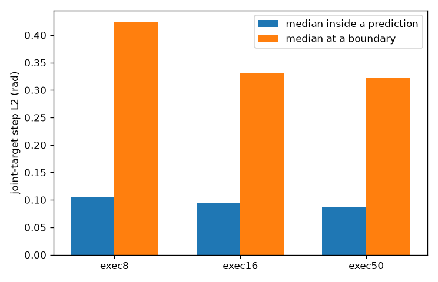

# chunk playback

Status: done

## Result

The arm does not move smoothly, and the 50-step chunk is the reason. This is a fail for the question in the plan. A longer playback will not help.

The boundary yank does shrink. The median joint-target step at a replan falls from 0.423595 rad on `exec8` to 0.331288 rad on `exec16` and 0.322005 rad on `exec50`. It also happens every 50 control steps instead of every 8. The trace for seed 30006 keeps its spikes, and the inside of a prediction stays noisy. On `exec50` the median step inside a prediction is 0.08791 rad, the 95th percentile is 0.215125 rad, and the largest inside step is 0.74146 rad. That inside maximum is larger than the median boundary yank. On seed 30006 the first prediction, before the first replan at step 51, changes the target by 0.470885 rad at step 21. The face-camera frames around that step show the hand changing pose while the peg stays on the table.

Insertions are 0/5 and grasps are 0/5 on every playback. The closest the grasp point came was 3.95 cm, on `exec8`. The hole needs about 6 mm. The miss is recorded below. The jitter inside the chunk is what fails the question.

## Process

Same weights, `checkpoints/peg_face_probe/best/pretrained_model`, fp32. Seeds 30003, 30006, 30013, 30014, 30032 from `data/datasets/peg_face_val/openarm_seeds.json`, instruction `place the peg in the hole`. Episode cap 900. Physics paused during `predict_chunk`. Right arm only, left arm at home, `grasp_right_peg` off. `SmolVLAAdapter.chunk_size` on the class stayed 16. Each run set `policy.chunk_size` on the instance and the number of steps executed before the next prediction. No training and no demo collection.

`peg_socket/chunk_playback.py` calls `zeroshot_eval.rollout`. The step size is the L2 norm of the change in the clipped joint target. A boundary is the first target of a prediction after the episode's first one. Started 09:38:55, plots written 09:47:42.

```
.venv\Scripts\python.exe -u peg_socket/chunk_playback.py --keep 16 --execute 8 --out peg_socket/findings/chunk_playback/exec8
.venv\Scripts\python.exe -u peg_socket/chunk_playback.py --keep 16 --execute 16 --out peg_socket/findings/chunk_playback/exec16
.venv\Scripts\python.exe -u peg_socket/chunk_playback.py --keep 50 --execute 50 --out peg_socket/findings/chunk_playback/exec50
.venv\Scripts\python.exe -u peg_socket/chunk_playback.py --plot peg_socket/findings/chunk_playback
```

`exec8` kept 16 and ran 8. The first prediction returned `action_shape=(16, 8)`. `exec50` kept 50 and ran 50. The first prediction returned `action_shape=(50, 8)`.

## Numbers



| Playback | Keep | Execute | Median inside | Median boundary | p95 inside | Max inside | Max boundary |
|---|---|---|---|---|---|---|---|
| exec8 | 16 | 8 | 0.105326 | 0.423595 | 0.248047 | 0.724844 | 2.129186 |
| exec16 | 16 | 16 | 0.094435 | 0.331288 | 0.231176 | 0.746875 | 1.2492 |
| exec50 | 50 | 50 | 0.08791 | 0.322005 | 0.215125 | 0.74146 | 0.74933 |

Units are radians, the L2 of the 8-D joint-target change. Counts are `n_inside` / `n_boundary`: 3935 / 560, 4215 / 280, 4410 / 85.


| Playback | Inserted | Grasps | Closest | Median of the per-episode closest |
|---|---|---|---|---|
| exec8 | 0/5 | 0 | 3.95 cm | 6.56 cm |
| exec16 | 0/5 | 0 | 6.52 cm | 7.03 cm |
| exec50 | 0/5 | 0 | 6.86 cm | 7.75 cm |

Every episode is `never_grasped` and ran 900 steps. From `exec8/eval_summary.json`:

```json
{
  "keep": 16,
  "execute": 8,
  "n": 5,
  "insertions": 0,
  "grasp_count": 0,
  "min_hand_to_peg_m": 0.0395132240649063,
  "median_episode_min_hand_to_peg_m": 0.06561836352231816,
  "median_l2_inside": 0.105326,
  "median_l2_boundary": 0.423595,
  "p95_l2_inside": 0.248047,
  "max_l2_inside": 0.724844,
  "max_l2_boundary": 2.129186
}
```

From `exec16/eval_summary.json`:

```json
{
  "keep": 16,
  "execute": 16,
  "n": 5,
  "insertions": 0,
  "grasp_count": 0,
  "min_hand_to_peg_m": 0.0652255905129605,
  "median_episode_min_hand_to_peg_m": 0.07031251779810631,
  "median_l2_inside": 0.094435,
  "median_l2_boundary": 0.331288,
  "p95_l2_inside": 0.231176,
  "max_l2_inside": 0.746875,
  "max_l2_boundary": 1.2492
}
```

From `exec50/eval_summary.json`:

```json
{
  "keep": 50,
  "execute": 50,
  "n": 5,
  "insertions": 0,
  "grasp_count": 0,
  "min_hand_to_peg_m": 0.06858683812693411,
  "median_episode_min_hand_to_peg_m": 0.07748844489758551,
  "median_l2_inside": 0.08791,
  "median_l2_boundary": 0.322005,
  "p95_l2_inside": 0.215125,
  "max_l2_inside": 0.74146,
  "max_l2_boundary": 0.74933
}
```

The log lines that match those medians:

```
done n=5 insertions=0 grasp_count=0 min_hand_to_peg_m=0.0395 median_l2_inside=0.105326 median_l2_boundary=0.423595
done n=5 insertions=0 grasp_count=0 min_hand_to_peg_m=0.0652 median_l2_inside=0.094435 median_l2_boundary=0.331288
done n=5 insertions=0 grasp_count=0 min_hand_to_peg_m=0.0686 median_l2_inside=0.08791 median_l2_boundary=0.322005
```

## Videos

Face camera, 25 fps, 451 frames, one clip per seed. The peg is on the table in every clip.

exec8, keep 16, run 8:

- [seed 30003](exec8/videos/seed30003.mp4), closest 7.65 cm
- [seed 30006](exec8/videos/seed30006.mp4), closest 3.95 cm
- [seed 30013](exec8/videos/seed30013.mp4), closest 7.77 cm
- [seed 30014](exec8/videos/seed30014.mp4), closest 5.68 cm
- [seed 30032](exec8/videos/seed30032.mp4), closest 6.56 cm

exec16, keep 16, run 16:

- [seed 30003](exec16/videos/seed30003.mp4), closest 7.03 cm
- [seed 30006](exec16/videos/seed30006.mp4), closest 6.63 cm
- [seed 30013](exec16/videos/seed30013.mp4), closest 6.52 cm
- [seed 30014](exec16/videos/seed30014.mp4), closest 7.59 cm
- [seed 30032](exec16/videos/seed30032.mp4), closest 7.87 cm

exec50, keep 50, run 50:

- [seed 30003](exec50/videos/seed30003.mp4), closest 7.96 cm
- [seed 30006](exec50/videos/seed30006.mp4), closest 7.64 cm
- [seed 30013](exec50/videos/seed30013.mp4), closest 8.49 cm
- [seed 30014](exec50/videos/seed30014.mp4), closest 7.75 cm
- [seed 30032](exec50/videos/seed30032.mp4), closest 6.86 cm

## Failures other agents should know

Do not play a longer chunk to smooth this policy. The shake is inside the 50 steps the checkpoint already emits. Do not fine-tune this folder, and do not point the run at `data/datasets/peg_train`, `peg_val`, or a throw checkpoint.

The stderr log is a reconstruction. The live stream was the unauthenticated Hugging Face warning and the `torch_dtype` deprecation, three times, with no traceback. Weights loaded from the local checkpoint.

## Sources

- `peg_socket/chunk_playback.py`
- `peg_socket/findings/chunk_playback/exec8/eval_summary.json`
- `peg_socket/findings/chunk_playback/exec16/eval_summary.json`
- `peg_socket/findings/chunk_playback/exec50/eval_summary.json`
- `peg_socket/findings/chunk_playback/jumps.png`
- `peg_socket/findings/chunk_playback/trace_seed30006.png`
- `peg_socket/findings/chunk_playback/closest.png`
- `peg_socket/findings/chunk_playback/run_stdout.txt`
- `checkpoints/peg_face_probe/best/pretrained_model`
- `data/datasets/peg_face_val/openarm_seeds.json`
