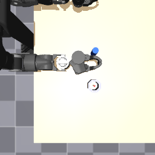
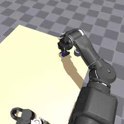

# face-camera prior fine-tune

Status: done

This is a prior test. It is not step 6. [localize](../localize/REPORT.md) never scored the peg, so the gated fine-tune in `peg_socket/README.md` has not been run. `data/datasets/peg_train` and `data/datasets/peg_val` are the overhead camera. They were not used here.

## Result

The fine-tune did not put the peg in the hole. On the 5 held-out layouts, step 500, step 1000, and the best checkpoint (step 1500) each inserted 0/5 and grasped 0/5. Every episode is `never_grasped`. The closest the grasp point came to the peg was 4.22 cm, at step 500. At the best validation loss it was 4.61 cm. The hole only allows about 6 mm.

Validation loss fell from 0.409 at step 250 to 0.151 at step 1500, and it was still falling at the end. That drop is the action head fitting the expert's joint targets. It did not move the hand onto the peg.

## Process

`tablecam` in `peg_socket/peg_socket_scene.xml` was moved off the overhead pose. The name is unchanged, so `observation.images.image_front` is still this camera. The wrist camera was not moved. `v2/` was not edited.

The accepted pose is between the shoulders, offset toward +y so it is off the right arm, looking down at the workspace:

```
pos="0.08 0.12 1.15" xyaxes="-0.9111 -0.4122 0.0000 0.3485 -0.7704 0.5339" fovy="60"
```

At the home keyframe and at the expert's grasp on seed 0, the peg cylinder and the socket walls project inside the 16 px margin on the 256 image, and the gripper is in frame. A ray from the camera to the peg and to the socket hits those objects at home. At the grasp, the ray to the peg center hits the outer finger, because the hand is on the peg, and the ray to the socket hits the socket. The four corners of the legal xy box also project inside that margin.

Overhead, for comparison, then the accepted home frame and the grasp frame:






Demos were collected with the existing expert and `peg_socket/collect_peg_demos.py`, one collector at a time. The 16 px filter reads the live `tablecam`, so it gated the face view. Success episodes only. Instruction `place the peg in the hole`.

```
.venv\Scripts\python.exe peg_socket/collect_peg_demos.py --n-success 10 --seed-start 20000 --seed-end 22000 --out data/datasets/peg_face_train --tag face_train
.venv\Scripts\python.exe peg_socket/collect_peg_demos.py --n-success 5 --seed-start 30000 --seed-end 32000 --out data/datasets/peg_face_val --tag face_val
```

Train seeds: 20001, 20005, 20013, 20014, 20021, 20023, 20028, 20040, 20041, 20046. Val seeds: 30003, 30006, 30013, 30014, 30032. The two lists do not overlap.

The legal draw is the expert's draw, plus the 16 px margin:

- uniform x `[0.18, 0.36]`, y `[-0.45, -0.18]`
- both objects upright on the table, at least 1 cm clear of the pedestal and of either gripper at home
- peg center at least 0.12 m from the socket center
- both objects inside `tablecam` with a 16 px margin

Batch 8 and batch 4 died on the first forward with the default CUDA allocator. The 6 GB card already had about 1 GB in use by the desktop. Batch 8 had 3.47 GiB allocated by PyTorch and then failed a 14 MiB request. Batch 4 had 2.65 GiB allocated and failed a 20 MiB request. `PYTORCH_CUDA_ALLOC_CONF=expandable_segments:True` aborted the process. Those logs are `train_oom_stderr.txt`, `train_oom_b4_stderr.txt`, and `train_oom_expand_stdout.txt`.

The run that finished used batch 2 and `PYTORCH_CUDA_ALLOC_CONF=backend:cudaMallocAsync`. Vision and the language model stayed frozen. No `--train-vision`. fp32. Learning rate `1.0e-4`, warmup 100, cosine decay over 1500 steps. Started `lerobot/smolvla_base`. Logged GPU memory was 3.26 GB. It started at 08:16:58 and the last validation was written at 08:42:46.

```
.venv\Scripts\python.exe -u scripts/train_smolvla.py --dataset-root data/datasets/peg_face_train --val-dataset-root data/datasets/peg_face_val --output-dir checkpoints/peg_face_probe --steps 1500 --batch-size 2 --warmup-steps 100 --save-freq 500 --val-every 250 --val-frames 256 --min-steps 500 --patience-evals 4
```

Validation improved at steps 250, 750, 1000, 1250, and 1500. Step 500 did not. Early stop did not fire. `best/` is step 1500.

Closed-loop eval is `peg_socket/eval_peg_policy.py`, which calls `zeroshot_eval.rollout` with the step cap set to 900. Expert episodes in this set are 698 to 861 steps, so a cap of 400, as in the zero-shot baseline, would time out a faithful copy of a demo. The same 5 val seeds were played at step 500, step 1000, and `best/`. Chunk 16, replan every 8, physics paused during `predict_chunk`. One face-camera video per episode.

## Numbers

| | Train | Val |
|---|---|---|
| Episodes | 10 | 5 |
| Frames | 8090 | 4137 |
| Length | 698–861, mean 809 | 806–852, mean 827 |
| Seeds scanned | 20000–20046 | 30000–30032 |
| too_close | 23 | 19 |
| pedestal_or_gripper | 11 | 6 |
| unreachable | 3 | 3 |
| tablecam_edge | 0 | 0 |
| expert failures not saved | 0 | 0 |

`dataset_stats` warns that color pairs collapsed. There is one task, `peg->socket`. That warning is the fixed instruction.


Training loss on step 1 is 1.379. On step 1500 it is 0.104. The pale line in the plot is the raw flow-matching loss. The blue line is a 20-step mean. Learning rate peaks at `1.0e-4` after the warmup and is `2.5e-6` on the last step. Grad norm starts near 26 and is about 2 at the end.

| Step | Val loss | Improved |
|---|---|---|
| 250 | 0.4089 | yes |
| 500 | 0.4083 | no |
| 750 | 0.2674 | yes |
| 1000 | 0.1822 | yes |
| 1250 | 0.1558 | yes |
| 1500 | 0.1513 | yes |


| Checkpoint | Inserted | Grasps | Closest | Median of the per-episode closest |
|---|---|---|---|---|
| step 500 | 0/5 | 0 | 4.22 cm | 6.05 cm |
| step 1000 | 0/5 | 0 | 5.46 cm | 6.82 cm |
| `best/` step 1500 | 0/5 | 0 | 4.61 cm | 6.74 cm |

All 15 episodes are `never_grasped`. The numbers are `eval_summary.json` in each folder below.

## Videos

Face camera, 25 fps, one clip per val seed. The filenames are `seed{seed}_never_grasped.mp4`.

Step 500:

- [seed 30003](step500/videos/seed30003_never_grasped.mp4), closest 6.05 cm
- [seed 30006](step500/videos/seed30006_never_grasped.mp4), closest 9.79 cm
- [seed 30013](step500/videos/seed30013_never_grasped.mp4), closest 11.40 cm
- [seed 30014](step500/videos/seed30014_never_grasped.mp4), closest 5.69 cm
- [seed 30032](step500/videos/seed30032_never_grasped.mp4), closest 4.22 cm

Step 1000:

- [seed 30003](step1000/videos/seed30003_never_grasped.mp4), closest 6.23 cm
- [seed 30006](step1000/videos/seed30006_never_grasped.mp4), closest 6.84 cm
- [seed 30013](step1000/videos/seed30013_never_grasped.mp4), closest 7.48 cm
- [seed 30014](step1000/videos/seed30014_never_grasped.mp4), closest 6.82 cm
- [seed 30032](step1000/videos/seed30032_never_grasped.mp4), closest 5.46 cm

Best checkpoint, step 1500:

- [seed 30003](best/videos/seed30003_never_grasped.mp4), closest 7.43 cm
- [seed 30006](best/videos/seed30006_never_grasped.mp4), closest 4.61 cm
- [seed 30013](best/videos/seed30013_never_grasped.mp4), closest 6.59 cm
- [seed 30014](best/videos/seed30014_never_grasped.mp4), closest 6.74 cm
- [seed 30032](best/videos/seed30032_never_grasped.mp4), closest 6.76 cm

## Why this happened

The face view shows the arm, the peg, and the hole together, including while the hand is at the peg. The expert inserted every legal layout that was kept. Ten of those insertions were enough for the action expert to drive the flow-matching loss down by about an order of magnitude.

The hand still stopped several centimeters short of the peg, and training further did not close that gap. Step 1000 and step 1500 are farther from the peg, in the median, than step 500. The frozen SigLIP tower was not trained on this camera. The same pattern is in the throw fine-tunes: the loss fits the reach, and the grasp stays centimeters off. The socket needs about 6 mm. 4.6 cm does not insert.

## Failures other agents should know

Do not train `checkpoints/peg_face_probe` again on `data/datasets/peg_train` or `peg_val`. Those videos are the overhead camera. Do not point this checkpoint at the throw scenes.

Do not retry batch 8 or batch 4 on this 6 GB card with the default caching allocator. The forward dies on a small allocation while `nvidia-smi` still shows free memory. The run that finished used batch 2 and `PYTORCH_CUDA_ALLOC_CONF=backend:cudaMallocAsync`. `expandable_segments:True` aborted the process. Leave the desktop's GPU use in the account: about 1 GB was already taken before PyTorch allocated.

`tablecam_edge` rejected nothing inside the legal box. A later collector can keep the same bounds. Do not run two collectors, and do not collect while this GPU job's successor is running.

Step 6 is still unstarted. This probe does not pass the localize gate, and it does not clear it.

## Sources

- `peg_socket/peg_socket_scene.xml`
- `data/datasets/peg_face_train`, `data/datasets/peg_face_val`
- `peg_socket/findings/demos/face_train_rejects.json`, `face_val_rejects.json`
- `peg_socket/findings/face_probe/train_stats.txt`, `val_stats.txt`
- `peg_socket/findings/face_probe/collect_train_stdout.txt`, `collect_val_stdout.txt`
- `checkpoints/peg_face_probe/train_log.csv`, `val_log.csv`, `best/step.txt`
- `peg_socket/findings/face_probe/curves.png`, `closed_loop.png`
- `peg_socket/findings/face_probe/step500/eval_summary.json`
- `peg_socket/findings/face_probe/step1000/eval_summary.json`
- `peg_socket/findings/face_probe/best/eval_summary.json`
- `peg_socket/eval_peg_policy.py`
