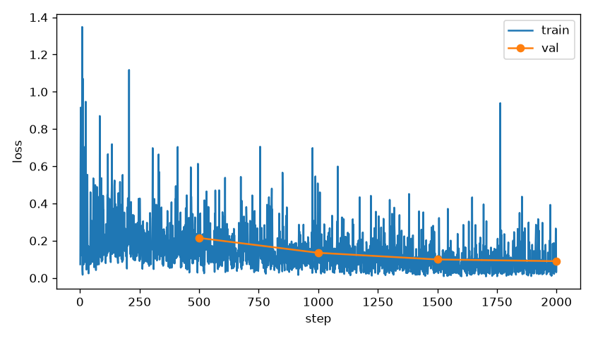
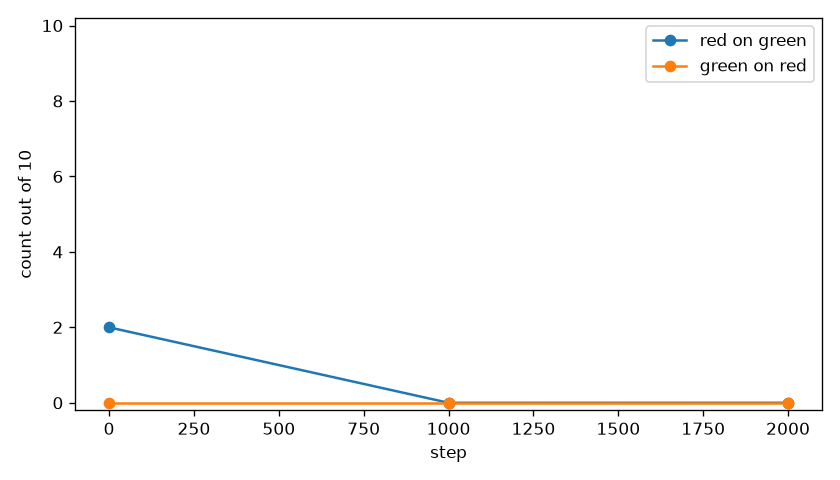

# Both red/green sentences

Cubes stay red and green on `red_box` and `green_box`. State dims 6:8 are the red body xy and dims 8:10 are the green body xy, z-scored with the same mean and std as `best/`. Dims 10:32 stay zero.
The sentence is the only thing that changes which cube should move. Vision and language stayed frozen. Init weights are `best/`.
Train loss was logged for 2000 steps. Counts are from `eval_summary.json`, seeds [30000, 30001, 30002, 30003, 30004, 30005, 30006, 30007, 30008, 30009].

## stack the red cube on the green cube

| step | stacks/10 | grasps/10 | drops | closest |
|---|---|---|---|---|
| 0 | 2 | 6 | 3 | 0.4 cm best, 7.0 cm mean |
| 1000 | 0 | 1 | 1 | 2.1 cm best, 13.4 cm mean |
| 2000 | 0 | 2 | 1 | 5.5 cm best, 13.5 cm mean |

## stack the green cube on the red cube

| step | stacks/10 | grasps/10 | drops | closest |
|---|---|---|---|---|
| 0 | 0 | 0 | 0 | 4.4 cm best, 8.5 cm mean |
| 1000 | 0 | 0 | 0 | 4.4 cm best, 12.6 cm mean |
| 2000 | 0 | 0 | 0 | 5.7 cm best, 12.9 cm mean |

Closest is the distance from the source cube center to the pose where it sits on the target cube.
A stack is that pose, in contact, for 0.5 s, with the target cube still on the floor.

Videos are the top camera with the wrist view inset: `videos/expert.mp4`, `videos/red_on_green_step0000.mp4`, `videos/red_on_green_step1000.mp4`, `videos/red_on_green_step2000.mp4`, `videos/green_on_red_step0000.mp4`, `videos/green_on_red_step1000.mp4`, `videos/green_on_red_step2000.mp4`.

Green on red stacked 0 of 10 at steps 0, 1000, and 2000. The two sentences were not told apart, so step 2 was not started. `best/` was left as it was. Red on green fell from 2 of 10 at step 0 to 0 of 10 at step 2000.
