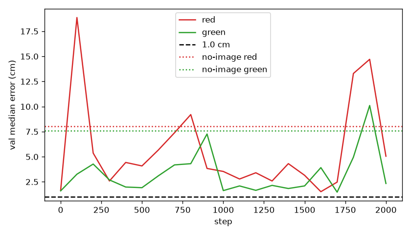

# so_see

The camera-only stack missed by about 9 cm. This run asked whether the frozen SigLIP tokens already know where the cubes are. They do, to about 1.6 cm. Training the tower on these 50 demos made that worse.

## Recipe

The stored stack episodes were replayed from their seeds and recorded actions. Replay matched the recordings, so the per-frame labels were kept. Start-pose error was 0. Joint error peaked at 0.42 deg on train and 0.12 deg on val. Episode 0's top camera differed from the stored video by 2.1 gray levels.

Labels are red xy, green xy, and whether that cube is still on the floor. Floor frames only: red 3078 train / 1051 val, green 9383 train / 3516 val. Green never leaves the floor. `camera1` only. The sentence stayed `stack the red cube on the green cube`.

The readout is a linear map on the frozen SigLIP 8×8 grid (64 tokens, 960-D), the same grid the connector emits. Tokens are z-scored, divided by the square root of the feature count, and clipped to [−1, 1]. The map is fit on train floor frames and scored on val floor frames. The no-image guess is the mean train position of that cube, picture ignored. Language and the action expert stayed frozen.

SigLIP was then trained because the frozen readout missed a 1.0 cm gate. Vision encoder only, language frozen, action expert untouched. fp32. Tower learning rate `1.0e-5`, readout `1.0e-3`, up to 2000 steps. The stored videos are the checker floor (`groundplane`). A plain blue floor was painted for a check and pointed back at the checker before any later rollout. The plain material can stay in the file; the geom has to use `groundplane`.

A 32×32 probe, on the patch tokens before the connector shrinks them to 8×8, was written and not run.

## The readout

Median xy error on the val floor frames:

| readout | red | green |
|---|---|---|
| frozen SigLIP, linear map | 1.60 cm | 1.55 cm |
| SigLIP trained, best of 2000 steps | 1.67 cm | 1.60 cm |
| no-image guess | 8.02 cm | 7.58 cm |

The gate is 1.0 cm for both cubes. Both readouts miss it. The trained run's best checkpoint is step 0, the pretrained tower with the frozen linear map reloaded. No later step beat that. Step 2000 is 5.05 cm red and 2.33 cm green. Train loss fell, then jumped after step 1770, and the val error went above the no-image line.

The action expert was not trained. No rollout on seeds 20000–20009.
