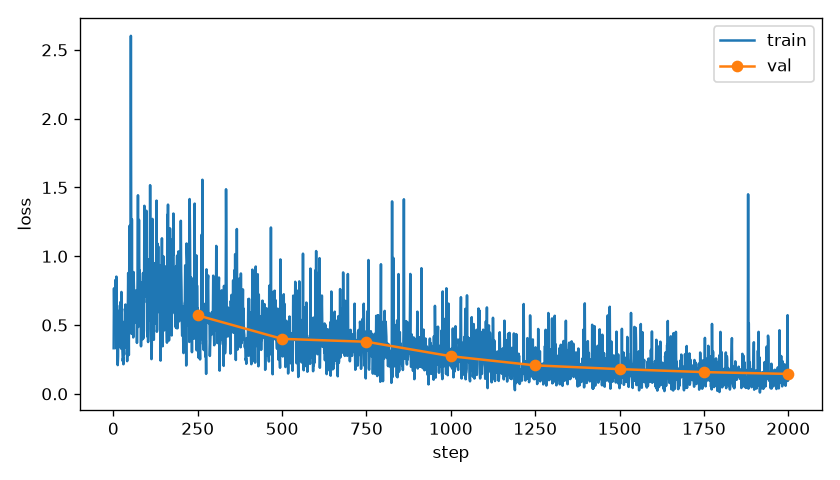
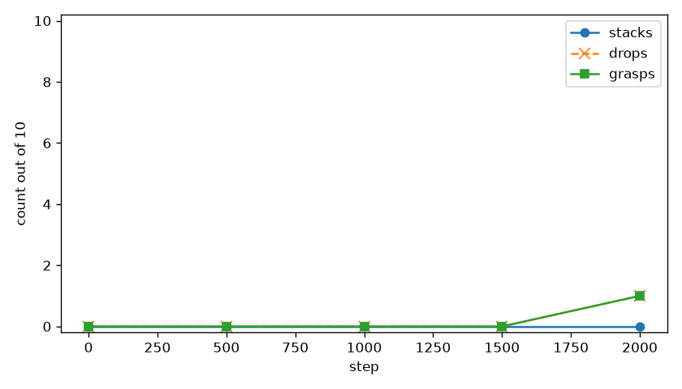

# so_stack

Camera and joints only. The action expert was trained to copy a scripted stack, and it never moved the red cube closer than the gap it was spawned with.

## Recipe

Scripted expert grasps the red cube, lifts it, sets it on the green cube, and opens. It may read cube poses. The policy does not. Layouts are on the floor in front of the base: x in (−0.12, 0.12), y in (−0.28, −0.15), cubes at least 8 cm apart. The expert passed 19/20 on seeds 0–19.

Demos are successes only. 50 train episodes, 20 validation episodes, no shared seeds. One sentence: `stack the red cube on the green cube`. Keys are `observation.images.camera1` (top), `observation.images.camera2` (wrist), `observation.state` (6 joint angles in degrees; pitch is negated because its axis is opposite the SO-100 shoulder), and `action` (the same 6, in degrees). Held-out seeds 20000–20009 were never in the fit.

Started from `lerobot/smolvla_base`. fp32. Vision encoder frozen. Language model frozen. Action expert only, about 100M of 450M parameters. Batch 2, learning rate `1.0e-4`, warmup 100, cosine over 2000 steps. Save every 500. Train loss every step, validation loss every 250. Closed loop is 30 Hz, replan every 10, physics paused while the chunk is computed. Success is the red cube resting on the green cube, in contact, for 0.5 s.

## The loss

Training loss fell and validation loss fell with it, down to about 0.15 at step 2000. That is the expert's joint targets, not a stack.

## The robot

| step | stacks/10 | grasps/10 | drops | closest |
|---|---|---|---|---|
| 0 | 0 | 0 | 0 | 9.4 cm best, 14.4 cm mean |
| 500 | 0 | 0 | 0 | 9.3 cm best, 14.5 cm mean |
| 1000 | 0 | 0 | 0 | 9.5 cm best, 14.5 cm mean |
| 1500 | 0 | 0 | 0 | 9.4 cm best, 14.4 cm mean |
| 2000 | 0 | 1 | 1 | 9.5 cm best, 14.5 cm mean |

Closest is the distance from the red cube center to the pose where it sits on the green cube. Best is the smallest of the 10 episodes. Mean is the average of each episode's minimum. The 9 cm best is the spawn gap: the arm never carried the cube closer than where it started. Step 2000 grasped once and dropped.

`step0000.mp4` is the base weights. `step2000.mp4` is the only grasp. Both are the top camera with the wrist view inset.
