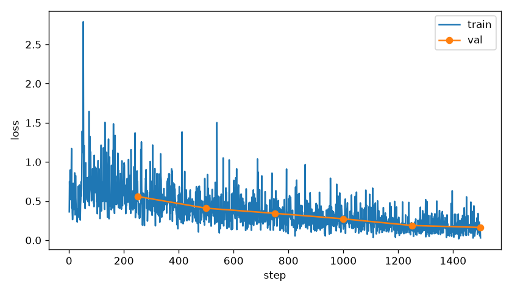
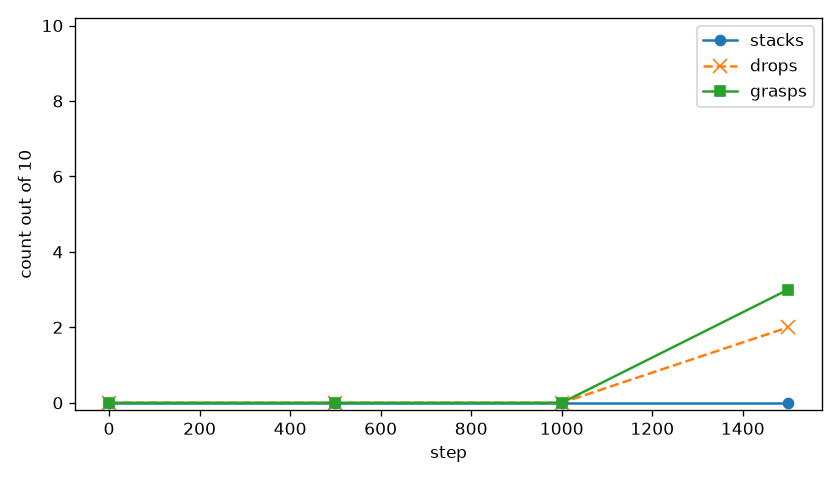

# so_xy

The frozen camera can place each cube to about 1.6 cm, and the action expert never used that. This run handed it the true positions instead. Grasps showed up at the last checkpoint. Nothing stacked. The run was cut at step 1500 of a 2000-step cosine because the clock ran out. The continuation is [so_xy_cont](../so_xy_cont/REPORT.md).

## Recipe

Same demos, cameras, sentence, and frozen vision and language as [so_stack](../so_stack/REPORT.md). The dataset files were not rewritten. State in the files stays 6 joint angles.

On every train and validation frame, red xy and green xy from the see-run labels were z-scored with the train-label mean and std and written into state dimensions 6:10, after the joint normalization. Dimensions 10:32 stayed zero. `state_proj` is `Linear(32 → 960)` and it trains. The forward hook checked that those four dims arrived at `state_proj` and were not all zero.

Train-label mean of (red x, red y, green x, green y): `0.00715, -0.21075, -0.00502, -0.21060`. Std: `0.07310, 0.03570, 0.06953, 0.03846`.

Started from `lerobot/smolvla_base`. fp32, batch 2, learning rate `1.0e-4`, warmup 100, cosine over 2000. Save every 500. Validation loss every 250, with xy filled the same way. At rollout, dimensions 6:10 are the live cube positions, z-scored with that same mean and std. Physics stays paused while the chunk is computed.

At step 1500 the learning rate was already down to `1.68e-5`.

## The loss

Validation loss: 0.56, 0.41, 0.34, 0.27, 0.19, 0.16 at steps 250 through 1500. Still falling when the run stopped.

## The robot

| step | stacks/10 | grasps/10 | drops | closest |
|---|---|---|---|---|
| 0 | 0 | 0 | 0 | 8.6 cm best, 14.3 cm mean |
| 500 | 0 | 0 | 0 | 9.3 cm best, 14.5 cm mean |
| 1000 | 0 | 0 | 0 | 9.2 cm best, 14.2 cm mean |
| 1500 | 0 | 3 | 2 | 1.4 cm best, 12.5 cm mean |

Steps 0, 500, and 1000 match the camera-only run: no grasps, and the best distance is the spawn gap. Step 1500 is the first change. Seed 20008 grasps, reaches 1.4 cm, and drops. Seed 20006 holds and stops at 3.3 cm. Seed 20004 grasps and drops without carrying the cube over. The other seven never grasp.

`step0000.mp4` is the base weights with xy filled in. `step1500.mp4` is the first grasps. Top camera, wrist view inset. Held-out seeds 20000–20009.
