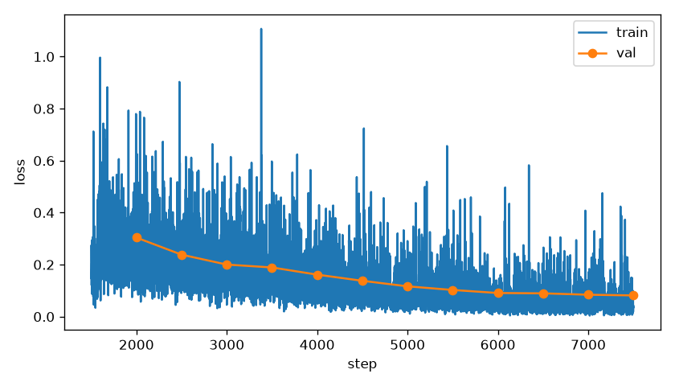
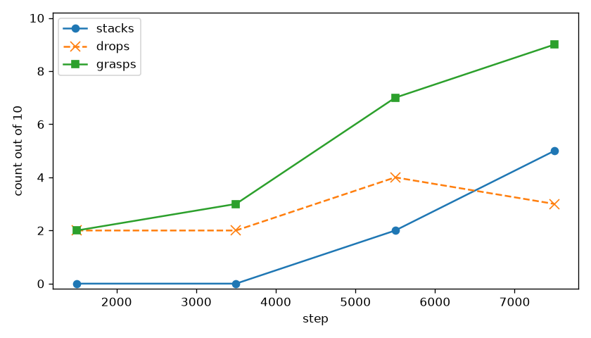

# so_xy_cont

The step-1500 policy had just started grasping, and its learning rate was already a sixth of peak. This run kept those weights, restarted the cosine, and trained 6000 more steps. It is the best model so far. The weights are copied to `trs_so_arm100/best`.

## Recipe

Same xy wiring as [so_xy](../so_xy/REPORT.md): true red and green xy in state dimensions 6:10, joints in 0:6, vision frozen, language frozen. Fresh Adam. The old optimizer state was not resumed. New cosine, warmup 100, peak learning rate `1.0e-4`, decay over the 6000 steps. Batch 2, fp32. Save every 2000. Validation loss every 500. The init checkpoint is so_xy step 1500, so the table below counts total steps from the original base.

## The loss

The new learning rate lifted validation loss from 0.16 back to 0.30 at the first check, then it fell for the rest of the run: 0.19 at step 2000 of this run (total 3500), 0.10 at total 5500, 0.082 at total 7500.

## The robot

| step | stacks/10 | grasps/10 | drops | closest |
|---|---|---|---|---|
| 1500 | 0 | 2 | 2 | 9.5 cm best, 14.1 cm mean |
| 3500 | 0 | 3 | 2 | 3.4 cm best, 11.6 cm mean |
| 5500 | 2 | 7 | 4 | 0.6 cm best, 8.9 cm mean |
| 7500 | 5 | 9 | 3 | 0.4 cm best, 2.1 cm mean |

Counts are from that rollout, seeds 20000–20009. The sentence is `stack the red cube on the green cube`. A stack is the red cube resting on the green cube, in contact, for 0.5 s. Closest is the distance from the red cube center to that pose.

Stacks start at total step 5500. Step 7500 grasps on 9 of 10 and stacks 5. It replans every 10 steps from the live cube positions, so a drop can be tried again. The three videos are total steps 3500 (still no stack), 5500 (first stacks), and 7500. Top camera, wrist view inset.

The vision encoder was not trained. This policy works because it is told the cube positions.
