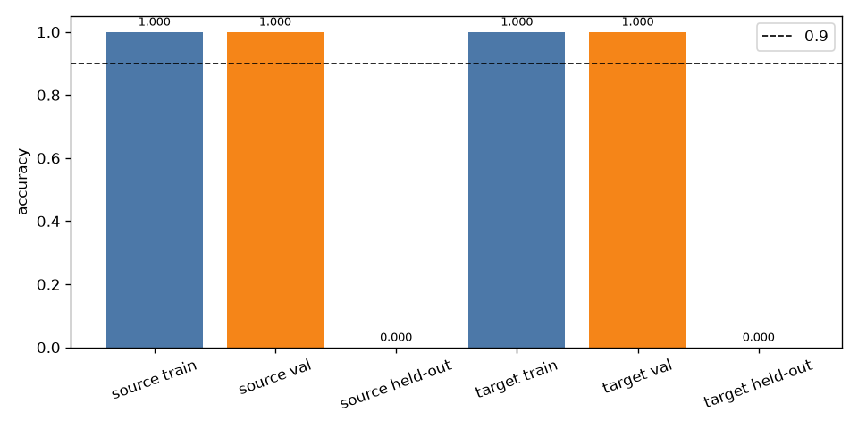

# Color probe

Train source 1.000, val source 1.000, held-out source 0.000. Train target 1.000, val target 1.000, held-out target 0.000.

The gate missed. The frozen notes did not separate the color words. Color training was not started. The text layers stay frozen.

Class order is red, green, blue, yellow. One reset frame per train episode, one per val episode, and one reset frame for each of seeds 33000–33009 with the yellow-on-blue sentence. Those held-out frames are not in the dataset. The note is the word-token mean, width 960.

Source fit: {'success': True, 'nit': 135, 'loss': 0.9604825321129504, 'message': 'CONVERGENCE: NORM OF PROJECTED GRADIENT <= PGTOL'}. Target fit: {'success': True, 'nit': 120, 'loss': 0.9452994966211876, 'message': 'CONVERGENCE: NORM OF PROJECTED GRADIENT <= PGTOL'}.
