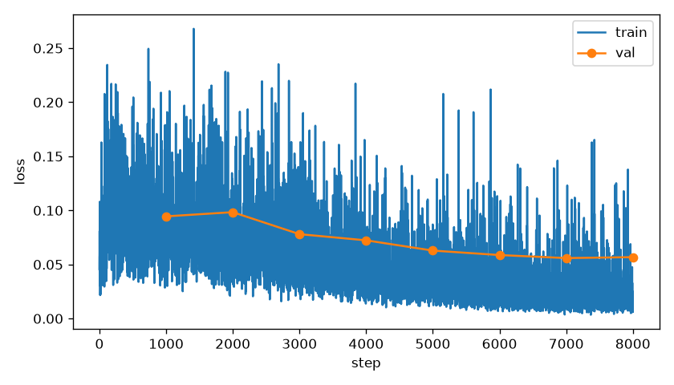
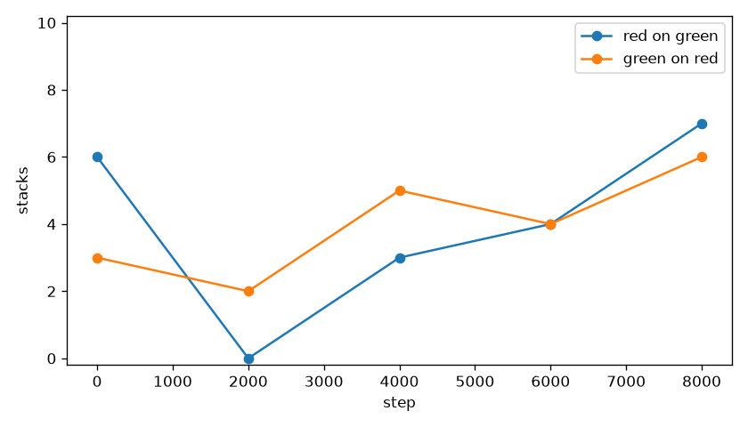
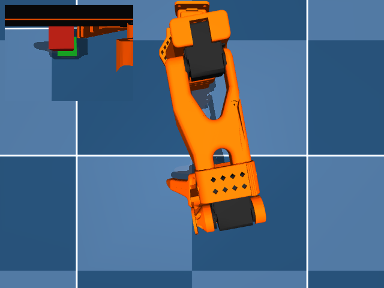
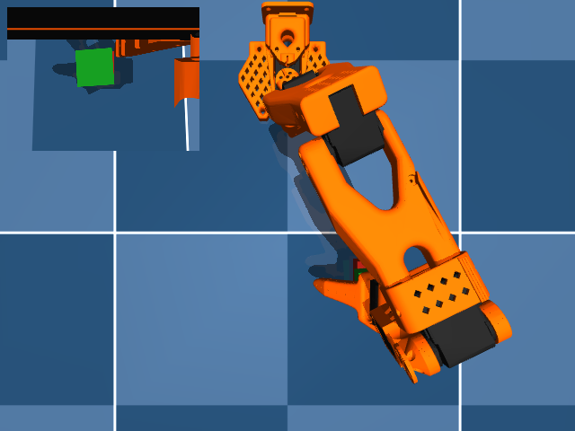

# Restart the cosine

Red on green stacked 7 of 10 at step 8000. Green on red stacked 6 of 10 at step 8000. Red on green is at least 5: true. Green on red is at least 5: true.

The use_note step-2000 rollout, from `use_note/eval_summary.json`, was red on green 5 of 10 and green on red 2 of 10. Step 0 here is a new rollout of the init weights (`C:\Users\Zain\Documents\Robotics-VLA-Thrower\trs_so_arm100\sentence\use_note\checkpoints\checkpoints\002000\pretrained_model`) on seeds 30000–30009. The table below is this rollout. The first 1000 steps took 21.4 minutes, faster than or equal to 45 minutes per 1000 steps, so this run stayed at 8000 steps.

Dims 6:10 stay the red body xy then the green body xy. Dims 10:12 are the frozen probe logits. Dims 12:32 stay zero. Vision, the text layers, the connector, and the classifier stayed frozen.
Train loss was logged for 8000 steps. Counts are from `eval_summary.json`, seeds [30000, 30001, 30002, 30003, 30004, 30005, 30006, 30007, 30008, 30009].
Last-step stack line: `step8000 red_on_green=7 green_on_red=6`.

## stack the red cube on the green cube

| step | stacks/10 | grasps/10 | drops | closest |
|---|---|---|---|---|
| 0 | 6 | 8 | 0 | 0.2 cm best, 4.1 cm mean |
| 2000 | 0 | 4 | 4 | 1.8 cm best, 11.6 cm mean |
| 4000 | 3 | 9 | 4 | 0.5 cm best, 4.7 cm mean |
| 6000 | 4 | 8 | 3 | 0.6 cm best, 5.3 cm mean |
| 8000 | 7 | 9 | 2 | 0.1 cm best, 3.1 cm mean |

## stack the green cube on the red cube

| step | stacks/10 | grasps/10 | drops | closest |
|---|---|---|---|---|
| 0 | 3 | 6 | 3 | 0.2 cm best, 7.9 cm mean |
| 2000 | 2 | 7 | 4 | 0.5 cm best, 6.4 cm mean |
| 4000 | 5 | 9 | 4 | 0.3 cm best, 3.5 cm mean |
| 6000 | 4 | 8 | 4 | 0.4 cm best, 5.5 cm mean |
| 8000 | 6 | 9 | 3 | 0.2 cm best, 4.5 cm mean |

Closest is the distance from the source cube center to the pose where it sits on the target cube.
A stack is that pose, in contact, for 0.5 s, with the target cube still on the floor.

The stills are step 8000. Each one is a success when that sentence stacked, otherwise the closest miss. Videos are the top camera with the wrist view inset: `videos/red_on_green_step0000.mp4`, `videos/red_on_green_step2000.mp4`, `videos/red_on_green_step4000.mp4`, `videos/red_on_green_step6000.mp4`, `videos/red_on_green_step8000.mp4`, `videos/green_on_red_step0000.mp4`, `videos/green_on_red_step2000.mp4`, `videos/green_on_red_step4000.mp4`, `videos/green_on_red_step6000.mp4`, `videos/green_on_red_step8000.mp4`.

## Gate

<!-- gate -->

R=7 at step 8000. G=6. G_prev=4. The phase-1 bar (both at least 5) is met. Branch `colors_from_run1`. Colors start from phase-1 step 8000 (`C:\Users\Zain\Documents\Robotics-VLA-Thrower\trs_so_arm100\sentence\cont\run1\checkpoints\checkpoints\008000\pretrained_model`). The clock asked for 4000 steps; the step rate left 4000.
