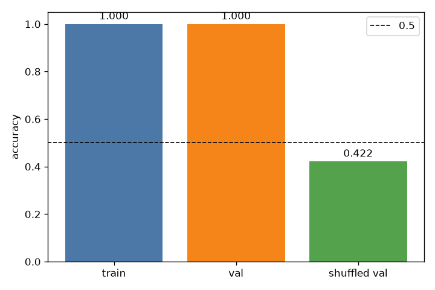
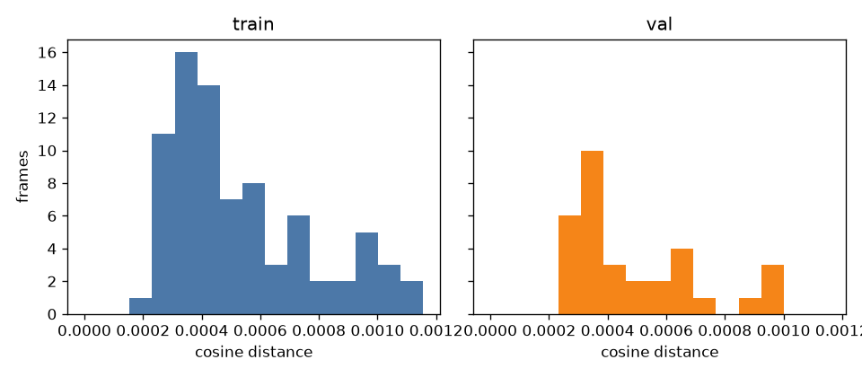
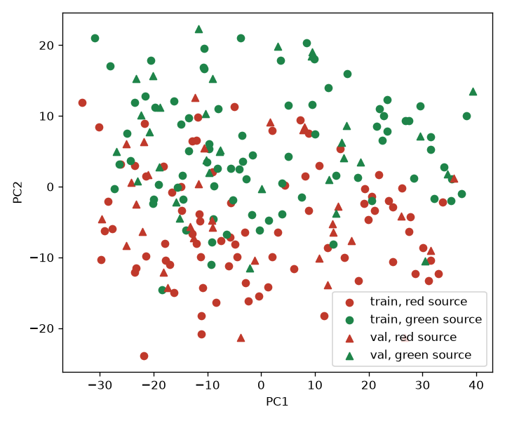
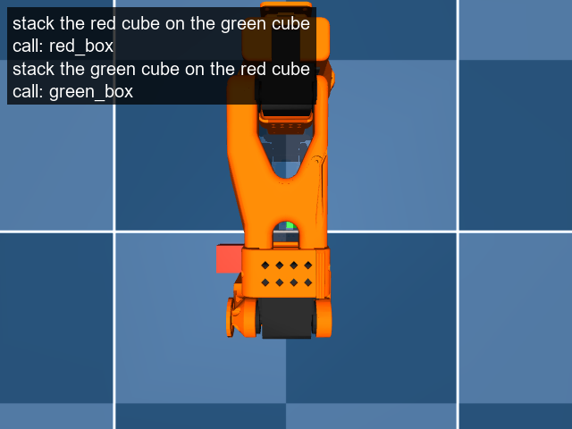

# Can the frozen sentence tell red from green?

Train accuracy 1.000 (160/160). Val accuracy 1.000 (64/64). Shuffled-val accuracy 0.422 (27/64). The note works: val accuracy is at least 0.90 and shuffled-val accuracy is at most 0.60. Step 2 runs. Step 3 does not.

The note is the mean of the word-token hidden states after the 16th text layer, before the final text norm. Width 960. The 64 front-camera tokens, the 64 wrist tokens, and the state token are left out. Each note averages 9 tokens whose language attention mask is 1. The language block is 48 positions, padding included in the block and left out of the mean.

Train seeds 80. Val seeds 32. Seeds 30000–30009 were not fit. The classifier is L2 logistic regression, C=1.0, on notes standardized with the train mean and std. The label is the source body the sentence names. `red_box` is class 0 and `green_box` is class 1. The shuffled classifier refits on the train labels permuted with seed 0 and is scored on the true val labels.

Mean cosine distance between the two notes on the same frame: train 0.0005, val 0.0005. Distance is 1 minus the cosine of the raw notes, before standardization.

First-seed tokens: red sentence `stack the red cube on the green cube
`, green sentence `stack the green cube on the red cube
`.









`frames/` has four val seeds. Both sentences and the classifier's call are written on the same top-camera still. The cubes are that seed's reset layout.

Accuracies and distances are from `probe.json`.

```
accuracies train=1.000000 val=1.000000 shuffled_val=0.421875 gate=works
```
