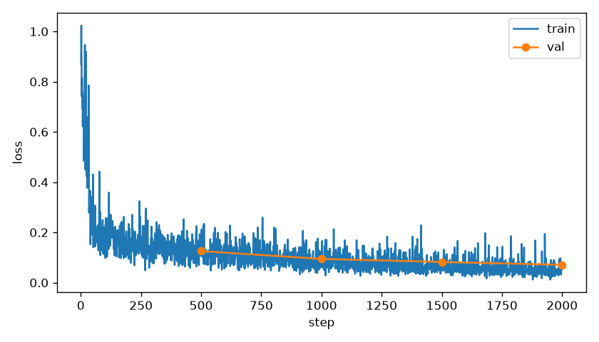
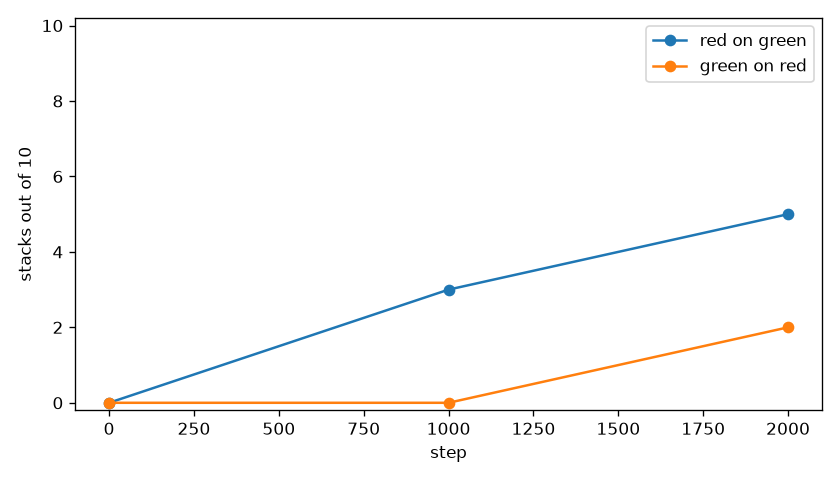
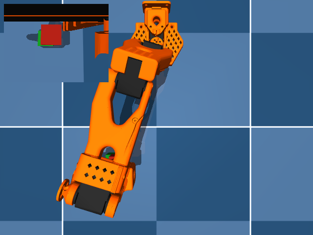
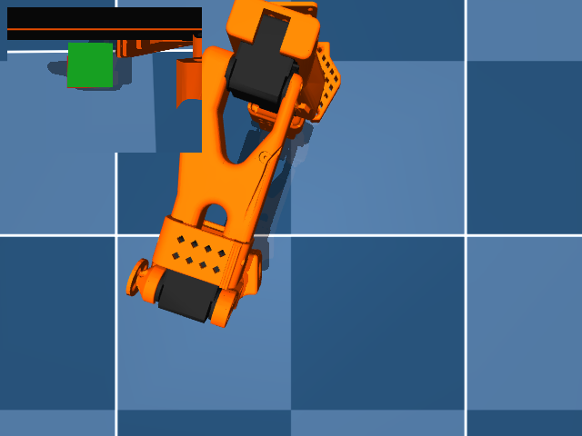

# The note as two numbers

The probe's val accuracy was 1.000 and its shuffled-val accuracy was 0.422, so this is the train that ran. The frozen classifier's two logits are written into state dims 10:12. Dims 6:10 stay the red body xy then the green body xy. Dims 12:32 stay zero.
Vision, the text layers, the connector, and the classifier stayed frozen. The action expert and `state_proj` trained, in fp32, from `best/`.
Train loss was logged for 2000 steps. Counts are from `eval_summary.json`, seeds [30000, 30001, 30002, 30003, 30004, 30005, 30006, 30007, 30008, 30009].

## stack the red cube on the green cube

| step | stacks/10 | grasps/10 | drops | closest |
|---|---|---|---|---|
| 0 | 0 | 0 | 0 | 9.7 cm best, 14.7 cm mean |
| 1000 | 3 | 7 | 3 | 0.1 cm best, 8.0 cm mean |
| 2000 | 5 | 8 | 3 | 0.5 cm best, 4.5 cm mean |

## stack the green cube on the red cube

| step | stacks/10 | grasps/10 | drops | closest |
|---|---|---|---|---|
| 0 | 0 | 0 | 0 | 9.8 cm best, 14.7 cm mean |
| 1000 | 0 | 5 | 3 | 1.3 cm best, 8.0 cm mean |
| 2000 | 2 | 5 | 3 | 0.9 cm best, 8.1 cm mean |

Closest is the distance from the source cube center to the pose where it sits on the target cube.
A stack is that pose, in contact, for 0.5 s, with the target cube still on the floor.

The stills are step 2000. Each one is a success when that sentence stacked, otherwise the closest miss. Videos are the top camera with the wrist view inset: `videos/red_on_green_step0000.mp4`, `videos/red_on_green_step1000.mp4`, `videos/red_on_green_step2000.mp4`, `videos/green_on_red_step0000.mp4`, `videos/green_on_red_step1000.mp4`, `videos/green_on_red_step2000.mp4`.

Red on green stacked 5 of 10 at step 2000. Green on red stacked 2 of 10 at step 2000.
